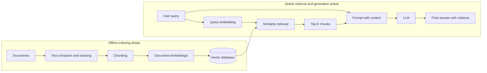

# Week 8 Deliverable: RAG Pipeline Architecture

## Objective

Retrieval-Augmented Generation (RAG) enables a Large Language Model (LLM) to answer questions using information from an external collection of documents. Instead of relying only on knowledge learned during training, the system retrieves relevant passages at query time and supplies them to the LLM as evidence.

The complete pipeline is:

**Documents -> Chunking -> Embeddings -> Vector Database -> User Query -> Query Embedding -> Retrieval -> Top-K Chunks -> LLM -> Final Answer**

RAG has two main phases:

1. **Indexing (offline):** Prepare documents and store their vector representations.
2. **Retrieval and generation (online):** Retrieve evidence for a user's question and generate a grounded answer.

## Architecture Diagram



## Phase 1: Indexing the Knowledge Base

### 1. Documents

The knowledge base begins with source documents such as PDFs, webpages, Word files, policies, reports, manuals, or database records. Text is extracted and cleaned before indexing. Cleaning can remove repeated headers, footers, navigation text, malformed characters, and duplicate content.

Useful metadata should be preserved, including:

- Document title and source
- Page number or section heading
- Author or creation date
- URL or file path
- Access-control information

Metadata makes citations possible and can also restrict searches to an appropriate source, department, date, or user permission.

### 2. Chunking

Documents are divided into smaller passages called **chunks**. A whole document is usually too large and too broad to retrieve as a single unit. Smaller chunks produce more precise matches and use the LLM's context window efficiently.

A common starting configuration is 400-600 tokens per chunk with 50-100 overlapping tokens. Overlap prevents important sentences at a boundary from losing their surrounding context. The best values depend on the document structure and the kinds of questions users ask.

Chunking strategies include:

- **Fixed-size chunking:** Simple and predictable, but may split ideas in awkward places.
- **Recursive chunking:** Splits first by sections and paragraphs, then by sentences if needed.
- **Semantic chunking:** Groups sentences by meaning, but requires more processing.
- **Structure-aware chunking:** Uses document headings, tables, pages, or code units.

Each chunk should keep a unique ID, its original text, and its source metadata.

### 3. Embeddings

An embedding model converts every chunk into a dense numerical vector. This vector represents semantic meaning rather than just exact words. Passages discussing similar concepts should therefore be near one another in vector space, even if they use different vocabulary.

Conceptually:

```text
embedding_model("Employees receive 20 annual leave days.")
    -> [0.018, -0.227, 0.491, ..., 0.064]
```

The exact numbers have no useful meaning individually; their relative position is what enables semantic search.

### 4. Vector Database

The system stores each chunk's vector alongside its text and metadata in a vector database. Examples include FAISS, Chroma, Qdrant, Pinecone, Milvus, and Weaviate.

A stored record has a structure similar to:

```json
{
  "id": "handbook-page-12-chunk-3",
  "vector": [0.018, -0.227, 0.491],
  "text": "Employees receive 20 annual leave days...",
  "metadata": {
    "source": "Employee Handbook",
    "page": 12,
    "section": "Annual Leave"
  }
}
```

The database creates an index so that nearest-neighbor searches remain fast even with a large number of chunks.

## Phase 2: Retrieval and Answer Generation

### 5. User Query

The online phase begins when a user asks a question, such as:

> How many annual leave days do employees receive?

The system may validate or rewrite an unclear query, but it should preserve the user's original intent.

### 6. Query Embedding

The query is converted into a vector using the same embedding model used for document chunks. Using the same model places both vectors in a compatible semantic space.

```text
query_vector = embedding_model(user_query)
```

The query embedding is temporary and is used to search the vector database.

### 7. Retrieval

The database compares the query vector with stored chunk vectors. Common similarity functions are cosine similarity, dot product, and Euclidean distance. The closest vectors represent chunks that are most semantically relevant to the question.

An enhanced pipeline may use **hybrid retrieval**, which combines semantic vector similarity with keyword search. This helps with exact names, codes, dates, and technical terms. Metadata filters can further limit results, for example to a particular department or document version.

### 8. Top-K Chunks

The retriever returns the `K` highest-scoring chunks. If `K = 5`, the five best candidates are returned. A reranker can then examine the question and candidate chunks together and reorder them more accurately.

The value of `K` is a trade-off:

- A value that is too small may omit necessary evidence.
- A value that is too large may introduce irrelevant text, increase latency, and distract the LLM.

The system can also apply a minimum relevance threshold. If no chunk meets it, the safest response is to state that the available documents do not contain enough information.

### 9. LLM

The selected chunks are inserted into a prompt together with the user's query and clear instructions. The LLM does not normally search the vector database itself; it reasons over the context already retrieved for it.

Example prompt:

```text
You are a question-answering assistant.
Answer only from the supplied context.
If the context is insufficient, say that the answer was not found.
Cite the source and page used.

Context:
[Chunk 1 with metadata]
[Chunk 2 with metadata]
[Chunk 3 with metadata]

Question:
How many annual leave days do employees receive?
```

### 10. Final Answer

The LLM synthesizes the evidence into a clear response:

> Employees receive 20 annual leave days per year. (Employee Handbook, p. 12)

A good final answer is relevant, supported by retrieved evidence, concise, and traceable to its source. It should distinguish between facts present in the documents and conclusions inferred from them.

## End-to-End Pseudocode

```python
# Offline indexing
documents = load_documents(source_directory)
chunks = chunk_documents(documents, chunk_size=500, overlap=75)

for chunk in chunks:
    vector = embedding_model.embed(chunk.text)
    vector_database.upsert(
        id=chunk.id,
        vector=vector,
        text=chunk.text,
        metadata=chunk.metadata,
    )

# Online question answering
question = get_user_query()
query_vector = embedding_model.embed(question)

candidates = vector_database.search(
    vector=query_vector,
    top_k=5,
)

relevant_chunks = apply_relevance_threshold(candidates)

if not relevant_chunks:
    answer = "The available documents do not contain enough information."
else:
    prompt = build_grounded_prompt(question, relevant_chunks)
    answer = llm.generate(prompt)

return answer_with_citations(answer, relevant_chunks)
```

## Practical Example: Employee Handbook

1. An employee handbook PDF is uploaded.
2. The system extracts and cleans its text.
3. The text is divided into overlapping, section-aware chunks.
4. The embedding model converts each chunk into a vector.
5. The vector database stores the vectors, text, page numbers, and headings.
6. A user asks, "What is the annual leave policy?"
7. The same embedding model converts the question into a vector.
8. Similarity search retrieves the passages about annual leave.
9. The best passages and the question are placed in the LLM prompt.
10. The LLM answers using those passages and cites the handbook pages.

## Why RAG Is Useful

- **Grounding:** Responses are based on supplied evidence.
- **Current knowledge:** Documents can be updated without retraining the LLM.
- **Domain adaptation:** Private organizational knowledge can be used at query time.
- **Traceability:** Metadata allows citations and source verification.
- **Lower cost:** Updating an index is normally cheaper than model fine-tuning.

RAG reduces hallucination risk, but it does not eliminate it. Poor extraction, incorrect chunking, weak retrieval, irrelevant context, or careless prompting can still produce unsupported answers.

## Quality and Evaluation

A RAG system should evaluate retrieval and generation separately.

### Retrieval metrics

- **Recall@K:** Whether the required evidence appears within the top `K` results.
- **Precision@K:** How many retrieved chunks are actually relevant.
- **Mean Reciprocal Rank (MRR):** How highly the first relevant chunk is ranked.

### Answer metrics

- **Correctness:** Whether the answer is factually correct.
- **Faithfulness:** Whether every claim is supported by the retrieved context.
- **Relevance:** Whether the answer directly addresses the question.
- **Citation accuracy:** Whether citations point to the evidence used.

A test set should contain representative questions, expected answers, and the source passages needed to answer them.

## Common Failure Modes and Improvements

| Failure | Likely cause | Improvement |
|---|---|---|
| Correct passage is not retrieved | Poor chunking or weak embeddings | Tune chunk size, add overlap, or evaluate another embedding model |
| Exact identifiers are missed | Vector search favors meaning over exact text | Add keyword search through hybrid retrieval |
| Too much irrelevant context | `Top-K` is too high | Lower `K`, add a score threshold, or use a reranker |
| Answer contains unsupported claims | Weak prompt or irrelevant evidence | Require context-only answers, citations, and an insufficient-evidence response |
| Outdated answer is returned | Old chunks remain indexed | Version documents and re-index changed sources |
| Restricted information is exposed | Permissions were not enforced during retrieval | Apply access-control filters before returning chunks |

## Key Design Principle

The LLM can only produce a reliable grounded answer when the retrieval stage supplies reliable evidence. Therefore, RAG quality depends on the whole pipeline—not only on the language model.

## Short Viva Explanation

RAG first prepares a searchable knowledge base by splitting documents into chunks, converting those chunks into embeddings, and storing them in a vector database. When a user submits a question, the same embedding model converts the query into a vector. The database retrieves the most semantically similar chunks, and the best `K` chunks are added to the LLM's prompt as context. The LLM then produces an answer grounded in that context, ideally with citations. If relevant evidence is not available, the system should say so rather than inventing an answer.

